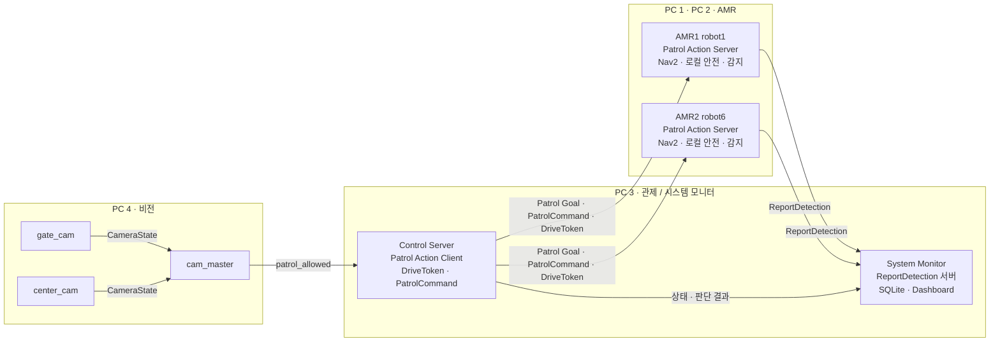

# 기똥차 — AMR 기반 지하주차장 순찰 시스템 (TurtleBot 4 × 2 · CCTV 차량 대응 · 시스템 모니터)

지하주차장의 화재 · 누수 · 적치물 의심 상황을 **AMR 두 대가 번갈아 순찰하며 찾고, CCTV 로 차량의 입출차를 보고 순찰을 멈추거나 이어 가며, 발견한 이상의 위치 · 시각 · 증적 이미지를 시스템 모니터에 남긴다.** 반복 점검의 부담을 줄이고, 이상이 보였을 때 관리자가 판단할 정보까지 전달하는 것이 목표다.

https://github.com/user-attachments/assets/7fb026e4-e6d3-4c78-8371-db6e1a35319d


> 두산 로보틱스 지능형 로보틱스 엔지니어 과정 · 지능-1 "SLAM 기반 자율주행 로봇 시스템 구현" · **기똥차** 팀 (이수현 · 박진용 · 서동권 · 박성현 · 고희태 · 조정묵 · 이영훈 · 노홍동, 이한혁 중도 포기, 멘토 Andy Kim) · 2026-08 ~ 2026-09

| 항목 | 내용 |
|---|---|
| 하드웨어 | TurtleBot 4 2대(`robot1` · `robot6`, OAK-D) · 고정 웹캠 2대(Gate · Center) · RC 카(진입 · 주차 시연 차량) · PC 4대 |
| 소프트웨어 | Ubuntu 24.04 · ROS 2 Jazzy · Nav2 · AMCL · Python 3.12 · YOLO11n · OpenCV · SQLite · Fast DDS |
| 결과 | 정상 순찰(wp1 ~ wp7 → 복귀 · 도킹) · 안전구역 이동과 재개 · 이벤트 감지 후 정지와 시스템 모니터 기록 시연 · 차량 모델 파인튜닝 후 Test Recall 1.000 · mAP50-95 0.737 · `CameraState` 계약 시험 2개 통과 · 전체 AMR 종단 통합시험은 **미실시**([결과](#결과)) |
| 바로 해 보기 | 로봇 · 카메라 · GPU 없이 Ubuntu 24.04 PC 한 대로 `CameraState` 계약 시험을 돌려 본다 → [실행 방법 1](#실행-방법) |

## 목차

1. [내 역할](#내-역할)
2. [주요 기능](#주요-기능)
3. [시스템 구성](#시스템-구성)
4. [결과](#결과)
5. [실행 방법](#실행-방법)
6. [개발 환경 · 사용 장비](#개발-환경--사용-장비)
7. [프로젝트 구조](#프로젝트-구조)
8. [팀 · 역할 분담](#팀--역할-분담)

## 내 역할

8명이 PM · 비전 · 관제 · AMR · 시스템 모니터로 나눠 만든 팀 프로젝트이고, 그중 내가 맡은 부분은 비전 파트(서동권과 공동)다. — **박진용**

- **CCTV 차량 상태 판정** — Gate 는 두 판정선을 넘는 순서로 입 · 출차, Center 는 주차 ROI 에 5초 머물면 주차로 판정한다. 이동 상태는 0.2초 연속 관측해야 확정하고 이벤트 쿨다운은 2초다([`gate_cam.py`](src/patrol_vision/patrol_vision/gate_cam.py) · [`center_cam.py`](src/patrol_vision/patrol_vision/center_cam.py)).
- **`cam_master` 순찰 허용 변환** — `camera_id` · topic 별 허용 state · `confidence` · 중복 `event_id` · 순서 역전을 모두 통과해야 `patrol_allowed` 가 바뀐다. 이벤트가 끊겨도 임의로 `false` 로 바꾸지 않고 마지막 값을 유지하며 5 Hz 로 발행한다([`cam_master.py`](src/patrol_vision/patrol_vision/cam_master.py)).
- **상태 중심 인터페이스** — 차량이 한 대라는 전제로 최고 confidence 박스 1개만 쓰고 트랙 ID 는 내보내지 않는다. 재시작해도 겹치지 않는 `event_id` 와 이벤트 · 영상 스트림 QoS 를 나눠 설계했다([`cam_common.py`](src/patrol_vision/patrol_vision/cam_common.py)).
- **차량 · 위험 이벤트 모델** — yolov8n · yolo11n · yolo26n 을 Recall 우선으로 비교해 yolo11n 을 고르고, Center 환경 이미지 약 250장을 더해 파인튜닝한 `car_best_v2` 를 적용했다(같은 Test 세트에서 Recall 0.944 → 1.000).
- **AMR 비전 연계** — OAK-D 감지 결과를 시스템 모니터까지 연결한 부분 통합 시연([`vision_node_v2.py`](src/patrol_amr_safety/patrol_amr_safety/vision_node_v2.py)).

## 주요 기능

- **두 AMR 교대 순찰** — 관제가 `Patrol` Action 으로 임무를 보내고 `DriveToken` 으로 한 번에 한 대에만 주행 권한을 준다. AMR 은 웨이포인트(wp1 ~ wp7)마다 90° 회전을 네 번 해 한 바퀴를 관측하고, 사이클이 끝나면 도킹한 뒤 순찰 결과를 보고한다.
- **차량 이동 대응** — 입구(Gate)와 주차 구역(Center) 웹캠이 차량 상태를 4가지로 판정하고 `cam_master` 가 순찰 허용 여부(`patrol_allowed`)로 바꿔 관제에 준다. 차량이 움직이면 AMR 은 가장 가까운 가장자리 웨이포인트로 대피하고, 허용되면 최근 웨이포인트부터 순찰을 이어 간다.
- **감지와 증적** — 순찰 중 화재 · 누수 · 적치물을 감지하면 그 자리에서 멈추고, 확정된 사건의 종류 · 위치 · 시각 · 이미지를 `ReportDetection` 서비스로 시스템 모니터에 저장한다. 화재가 확정되면 현재 임무를 마친 뒤 토큰을 회수해 전체 순찰을 멈춘다.
- **시스템 모니터** — 로봇 상태 · 차량 로그 · 감지 사건과 증적 · 순찰 이력을 SQLite 와 이미지 파일로 저장하고, 읽기 전용 대시보드(지도 · 4분할 영상 · 최근 로그)와 이력 조회를 제공한다. 로그인 · 세션과 서버 측 권한 검사로 관리자 기능을 막는다.
- **계약 중심 개발** — 4개 개발 단위(AMR · 관제 · 비전 · 시스템 모니터)가 `patrol_interfaces` 한 패키지의 계약을 공유한다. 변경은 수정 요청서(CR)와 TBD ID 로 기록하고, 팀이 같은 커밋의 인터페이스 패키지를 빌드해 해시를 비교한다.

### 시스템 모니터 화면

<p align="center">
  <br>
  <sub>개선 후 대시보드 — 상단 상태 요약, 지도 · 4분할 영상 · 최근 로그, 화면 폭에 따라 3열 → 2열 → 1열 전환</sub>
</p>

## 시스템 구성

### 환경 구성

<p align="center">
  <br>
  <sub>시연 환경 — 순찰 경로 · 웨이포인트 · 주차 구역 · 웹캠 위치(입출차 구역 / 주차 구역) · RC 카 · 도킹 스테이션</sub>
</p>

### 아키텍처

네 대의 PC, 두 대의 TurtleBot 4, 두 대의 웹캠으로 구성한다. 개발한 팀과 실제로 실행되는 장비의 위치를 구분한다(비전팀의 AMR 감지 노드는 각 AMR PC 에서 실행).

<p align="center">
  <br>
  <sub>4 PC · 2 AMR 구성과 실행 위치</sub>
</p>

<details>
<summary>텍스트(Mermaid)로 보는 아키텍처</summary>



</details>

| 개발 단위 | 실행 위치 | 책임 |
|---|---|---|
| AMR | PC 1 · PC 2 | `Patrol` Action Server, Nav2 · AMCL 주행, 로컬 안전(`local_safety_supervisor`), 배터리 · 도킹, 로컬 감지 |
| 관제 | PC 3 | `Patrol` Action Client, `PatrolCommand`, `DriveToken`, permit 기반 중재 · 교대 |
| 비전 | PC 4 | CCTV 차량 상태(`CameraState`)와 `patrol_allowed` |
| 시스템 모니터 | PC 3 | `ReportDetection` 저장, 상태 · 이력 읽기 전용 표시 |

로봇은 `robot1`(PC 1, AMR1)과 `robot6`(PC 2, AMR2)로 구분하고, 위치는 공통 `map` 좌표계, `ROS_DOMAIN_ID=6` 을 쓴다. 최종 속도 출력은 AMR 의 `local_safety_supervisor` 만 발행한다.

### 주요 통신 (`patrol_interfaces 2.0.0`)

| 방식 | 인터페이스 | 송신 → 수신 | 역할 |
|---|---|---|---|
| Action | `Patrol` | 관제 → AMR | 순찰 요청 · 진행 · 결과 (감지 진행 · 확정도 Feedback 으로 전달) |
| Topic | `PatrolCommand` | 관제 → AMR | 실행 중 안전구역 이동 · 재개 |
| Topic | `DriveToken` | 관제 → AMR | 로봇별 주행 권한 |
| Topic | `CameraState` | gate_cam · center_cam → cam_master | 차량 상태 이벤트 |
| Topic | `/vision/cctv/patrol_allowed` (`Bool`) | cam_master → 관제 | 순찰 허용 여부 |
| Service | `ReportDetection` | AMR → 시스템 모니터 | 확정 사건과 증적 이미지 저장 |

계약의 유일한 기준은 [docs/interfaces.md](docs/interfaces.md)이다. 초기에는 순찰 명령과 감지 결과를 여러 Topic 으로 나눠 보냈지만, 통합하면서 하나의 작업으로 볼 수 있는 기능은 Action · Service 로 묶고 계속 갱신되는 정보(`DriveToken`, CCTV 상태)는 Topic 으로 남겼다.

### 동작 흐름

```
① 시작    관제가 Patrol Goal 을 보내면 AMR 이 토큰을 기다리다가, 토큰을 받으면 순찰(PATROL)로 전환
② 순찰    wp1 → wp7 을 방문하고 각 지점에서 90° 회전 4회로 한 바퀴를 관측
③ 감지    이동 중 이벤트가 확정되면 정지 → ReportDetection 으로 종류 · 위치 · 시각 · 이미지 저장 → 최근 웨이포인트부터 재개
④ 대응    CCTV 가 ENTERING / EXITING 을 알리면 patrol_allowed=false → 가장 가까운 가장자리 웨이포인트로 대피
          PARKED / EXITED 가 되면 patrol_allowed=true → 관제의 재개 명령으로 최근 웨이포인트부터 순찰 재개
⑤ 종료    도킹하면 한 사이클 종료 → 순찰 결과 보고 → 관제가 다음 사이클을 robot1 · robot6 중 누가 맡을지 판단
```

### 차량 탐지 화면

<p align="center">
  <br>
  <sub>차량 진입 비전 탐지 — Gate · Center 웹캠 화면과 비전 터미널</sub>
</p>

## 결과

아래는 이 저장소에서 직접 확인할 수 있는 값이다. 발표 자료에만 있는 내용은 구분해 적었다.

| 항목 | 결과 | 근거 | 비고 |
|---|---|---|---|
| `CameraState` 계약 | 상태 enum 0 ~ 4 · `camera_id` · topic 별 허용 state · `patrol_allowed` 매핑 · 5 Hz 상수 | `src/patrol_vision/test/test_p0_camerastate.py` 2개 통과 | 카메라 · YOLO 판정은 시험 대상이 아님 |
| 차량 모델 | 선정 단계(`car_best`) Test mAP50-95 0.696 · Recall 0.988 → 파인튜닝(`car_best_v2`) Test Recall 0.944 → 1.000 · mAP50-95 0.712 → 0.737 | [선정 보고서](data/car_data/latest_model_selection_report.md) | 두 비교는 서로 다른 Test 세트 기준. 시연 환경(RC 카) 데이터 |
| 정상 순찰 · 도킹 | wp1 ~ wp7 이동 후 복귀 · 도킹 | 발표 자료의 시연 영상 | 정량 지표 없음 |
| 안전구역 이동과 재개 | 관제 명령으로 순찰 중단 후 재개 | 발표 자료의 시연 영상 | |
| 이벤트 감지와 기록 | 순찰 중 화재 감지 → 정지 → 시스템 모니터 로그 · 이미지 | 발표 자료의 시연 영상(부분 통합) | 모형 촛불 · 색지로 재현. 영상에서 "이벤트 탐지 시 AMR 멈춤 후 재개"는 **구현 중**으로 표기 |
| 차량 입출차 탐지 통합 | 관제 + 비전 + 시스템 모니터 통합 영상 | 발표 자료의 시연 영상 | |
| 전체 AMR 종단 통합시험 | — | 문서 기준 종단 시험 전 | **미실시** |

### 알려진 한계

- **전체 AMR 순찰까지 완전 통합하지 못했다.** AMR 핵심 기능 구현이 늦어져 통합이 지연됐고, 인터페이스를 Action · Service 로 다시 정리했다. 이벤트 감지와 시스템 모니터 연계는 부분 통합으로 검증했다.
- 화재 · 누수는 모형 촛불과 색지로 단순하게 재현했고, 실제 화재 · 누수 환경의 탐지 성능은 검증하지 못했다. 차량 1대 시연 조건이며 여러 대가 움직이는 실제 주차장은 검증하지 않았다.
- 순찰 인력시간 40% 이상 절감 같은 사업 가치 지표는 **목표치**이며 실증하지 않았다.
- **발표 자료의 최종 `PARKED` 조건(bbox 전체가 ROI 안)이 이 저장소의 `center_cam.py` 에는 반영되어 있지 않다.** 코드는 `get_current_roi(best_cx, best_cy, …)` 로 bbox 중심점만 본다. 최종 코드가 다른 PC 에만 있다면 저장소에 반영해야 한다.
- 모델 가중치(`.pt`)가 저장소에 없고 `gate_cam.py` · `center_cam.py` 가 가중치를 개발 PC 의 절대경로에서 읽는다. 이 상태로는 클론만으로 비전 노드가 실행되지 않는다([실행 방법 2](#실행-방법)).
- 차량 모델 보고서는 ByteTrack 을 언급하지만 코드는 `predict` 후 최고 confidence 박스 1개를 쓴다. 동작의 기준은 코드와 [vision.md](docs/vision.md)다.

## 실행 방법

### 1. `CameraState` 계약 시험 (로봇 · 카메라 · GPU 불필요)

ROS 2 Jazzy 가 설치된 Ubuntu 24.04 에서 실행한다([공식 안내](https://docs.ros.org/en/jazzy/Installation/Ubuntu-Install-Debs.html)).

```bash
git clone https://github.com/abyssGo/patrol.git
cd patrol
sudo apt install -y python3-colcon-common-extensions python3-pytest
source /opt/ros/jazzy/setup.bash
colcon build --packages-select patrol_interfaces patrol_vision
source install/setup.bash
python3 -m pytest src/patrol_vision/test/test_p0_camerastate.py -q
```

| 확인 | 통과 기준 |
|---|---|
| 마지막 줄 | `2 passed` |

### 2. 전체 시스템 (장비 필요)

TurtleBot 4 2대 · 웹캠 2대 · PC 4대와 Discovery Server 가 필요하다. 모든 PC 에서 같은 커밋의 `patrol_interfaces` 를 빌드하고 `ROS_DOMAIN_ID=6` 을 맞춘다. 기동 순서와 종단 시험은 [docs/integration.md](docs/integration.md), 환경은 [docs/architecture.md](docs/architecture.md)를 따른다.

```bash
source /opt/ros/jazzy/setup.bash && colcon build && source install/setup.bash
ros2 launch patrol_vision cctv_cam.launch.py     # PC 4: gate_cam · center_cam · cam_master (차량 모델 가중치 필요)
```

> 비전 노드를 실행하려면 `ultralytics` 와 차량 모델 가중치 `car_best_v2.pt` 가 필요하고, 현재 코드는 이를 `/home/hv-06/patrol/data/car_data/car_best_v2.pt` 에서 읽는다. 가중치는 저장소에 포함되어 있지 않다.

## 개발 환경 · 사용 장비

| 항목 | 값 |
|---|---|
| OS · 미들웨어 | Ubuntu 24.04 · ROS 2 Jazzy · Fast DDS(Discovery Server) · `ROS_DOMAIN_ID=6` |
| 주행 | TurtleBot 4 · Nav2 · AMCL · `map` 좌표계 |
| 비전 | Ultralytics YOLO11n · OpenCV · OAK-D(AMR) · 웹캠(Gate · Center) |
| 저장 · 화면 | SQLite · 이미지 파일 · 읽기 전용 Dashboard(로그인 · 세션) |
| 언어 · 도구 | Python 3.12 · colcon · pytest · Git/GitHub |

## 프로젝트 구조

```text
patrol/
├── README.md
├── AGENTS.md                      공용 개발 규칙과 책임 경계
├── docs/                          설계 · 인터페이스 · 시나리오 · 통합 · 개발 기록 (docs/README.md 가 문서 지도)
├── src/
│   ├── patrol_interfaces/         공용 계약(Action · msg · srv)
│   ├── patrol_amr/                AMR 임무 · Nav2 연결
│   ├── patrol_amr_safety/         로컬 안전 · AMR 감지
│   ├── turtlebot4_navigation/     TurtleBot 4 내비게이션 설정
│   ├── patrol_control/            관제 노드
│   ├── patrol_vision/             CCTV 차량 비전 · cam_master
│   ├── patrol_sysmon/             시스템 모니터(저장 · Dashboard)
│   └── patrol_bringup/            통합 실행
├── data/                          모델 선정 보고서(car_data · detection_data)
├── maps/ · state/ · scripts/      지도 · 상태 파일 · 보조 스크립트
└── tests/                         통합 · 단위 시험
```

## 팀 · 역할 분담

8명이 PM · 비전 · 관제 · AMR · 시스템 모니터로 나눠 개발했다(이한혁은 중도 포기). 개발 단위별 책임은 [AGENTS.md](AGENTS.md)에 정리되어 있다.

| 구분 | 담당자 | 주요 담당 | 상세 문서 |
|---|---|---|---|
| PM | 이수현 | 요구사항 · 개발 진행 기준 정리, 일정 · 협업 조율 | [요구사항 · 시나리오](docs/scenarios.md) |
| 비전 | **박진용** · 서동권 | 차량 상태 판정(Gate 선 통과 · Center ROI 체류) · `cam_master` 의 `patrol_allowed` 변환 · 카메라 통합 · 차량 · 위험 이벤트 모델 학습과 탐지 | [vision.md](docs/vision.md) |
| 관제 · 통합 | 고희태 | 임무 · 주행 권한(`DriveToken`) 관리 · 차량 대응 · AMR 선정 · 팀 간 연동 | [control_server.md](docs/control_server.md) |
| AMR | 조정묵 · 박성현 | 주행 · 로컬 안전 · 상태 관리, 관측 · 대피 · 재개 · 도킹 | [amr.md](docs/amr.md) |
| 시스템 모니터 | 노홍동 · 이영훈 | ROS 어댑터 · 데이터 저장, 대시보드 표시 · 순찰 이력 조회 | [monitoring_and_data.md](docs/monitoring_and_data.md) |

문서 지도는 [docs/README.md](docs/README.md), 공용 개발 규칙은 [AGENTS.md](AGENTS.md)에 있다. 이 저장소는 팀 저장소를 fork 한 것이며 라이선스 파일은 포함되어 있지 않다.
